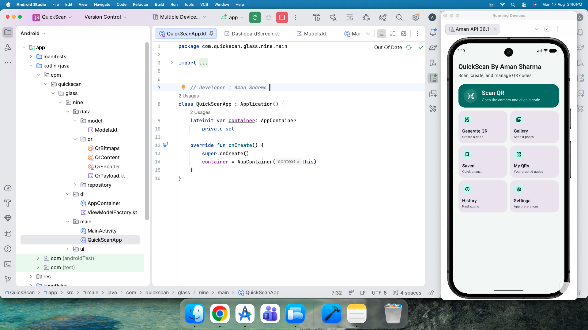
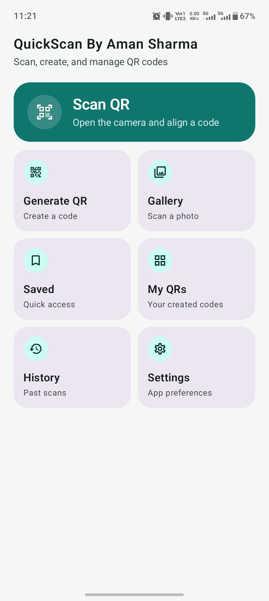
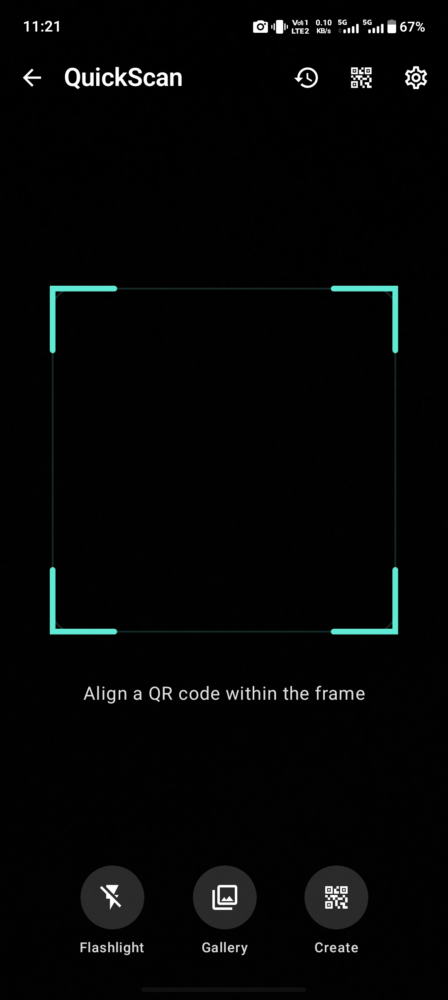
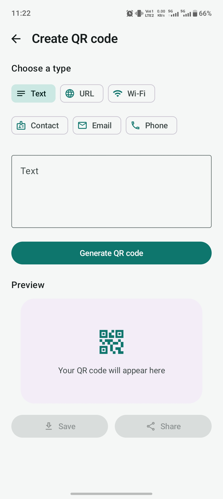
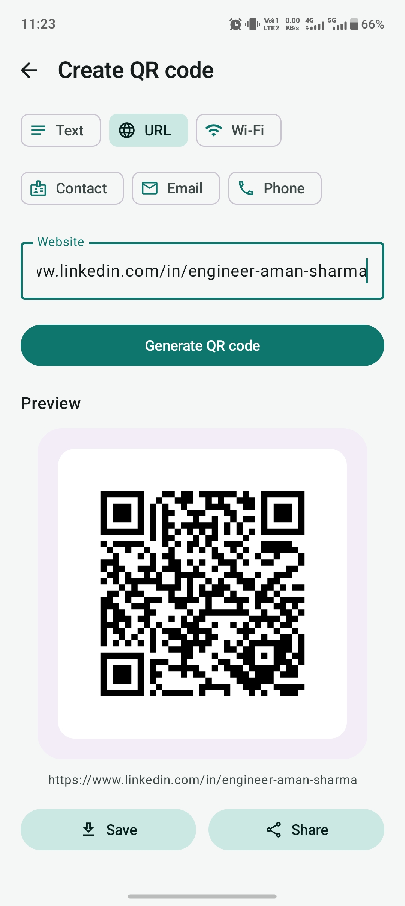
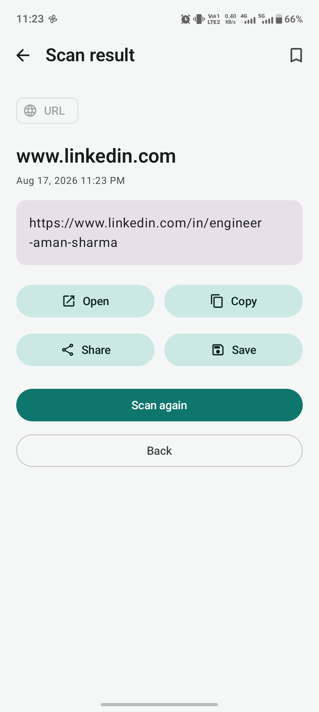
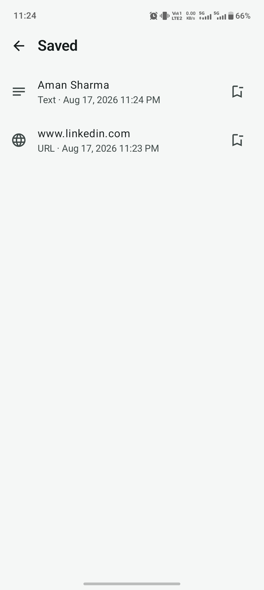
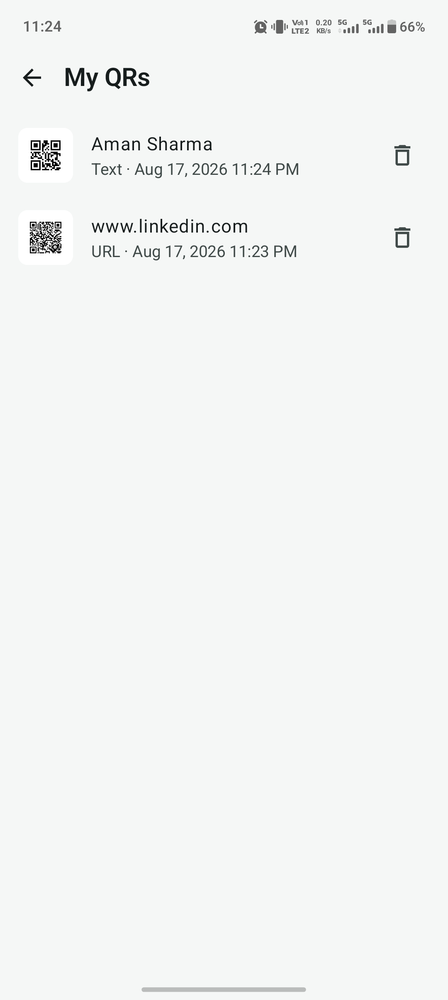
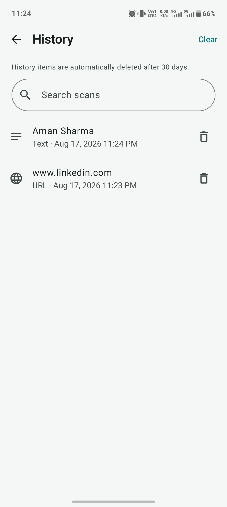
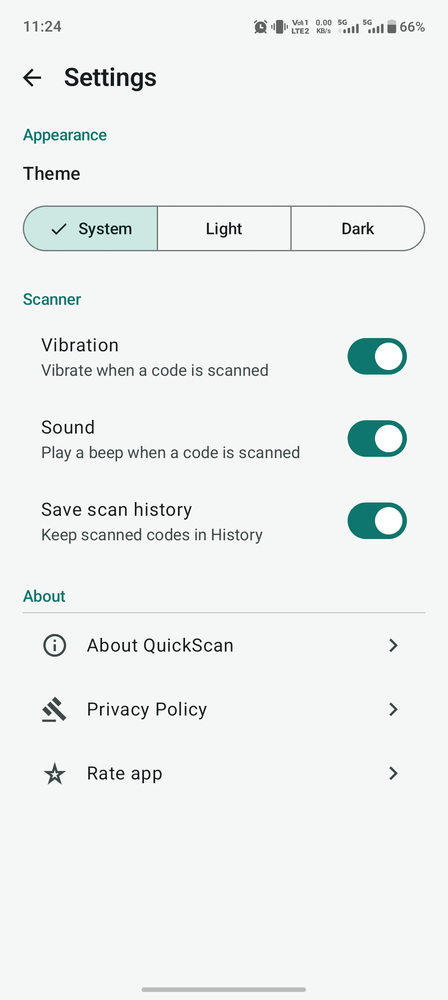

# QuickScan

A modern QR scanner and generator app built with Kotlin, Jetpack Compose, and Material 3.

QuickScan is designed to make scanning, creating, saving, and managing QR codes simple and fast, with a responsive interface across different Android screen sizes.

  

## Features

- Scan QR codes using the camera
- Scan QR codes from images in the gallery
- Flashlight support while scanning
- Automatic QR content type detection
- Support for URL, text, phone, email, Wi-Fi, contact, and location QR codes
- Open URLs directly through the device's normal web browser
- Scan result actions including open, copy, share, save, and scan again
- Generate QR codes for text, URLs, Wi-Fi, contacts, email, and phone numbers
- Preview generated QR codes
- Save and share generated QR codes
- QR codes compatible with standard QR scanners and other QR apps
- Persistent local scan history
- Search scan history
- Delete individual scan results
- Clear scan history
- Save important QR results for quick access
- Manage saved QR codes
- Theme preferences with light and dark modes
- Vibration and sound preferences
- Camera and storage permission handling
- Error handling for invalid QR codes and unsupported content
- Core scanning, generation, and history features available offline
- Clean Material 3 interface
- Responsive layouts for different Android screen sizes
- Smooth navigation and interactions

## Built With

- Kotlin
- Jetpack Compose
- Material 3
- Android
- Modern Android development tools
- Camera and media APIs
- Local data storage

## My Role

I designed and developed the complete application independently, including the UI, QR scanning and generation experience, navigation, interactions, local history, settings, permission handling, error handling, and responsive layouts.

The application was built with Jetpack Compose to keep the interface flexible and consistent across different screen sizes.

I also focused on keeping the core scanning, QR generation, and history features available without requiring an internet connection.

## Screenshots

  
  
  

  
  
  

  
  
  

For the complete collection, visit the [screenshots folder](./screenshots/).

## Client Project

This application was developed for a client, so the source code is not publicly available.

The screenshots were captured during development before the final delivery. The developer branding shown in the screenshots was removed from the version delivered to the client.

## Project Details

- Package Name: `com.quickscan.glass.nine`
- Status: Client Project — UI, features, and availability may change in the future.
## Developer

**Aman Sharma**

Android Developer | Kotlin | Jetpack Compose

[LinkedIn](https://www.linkedin.com/in/engineer-aman-sharma)